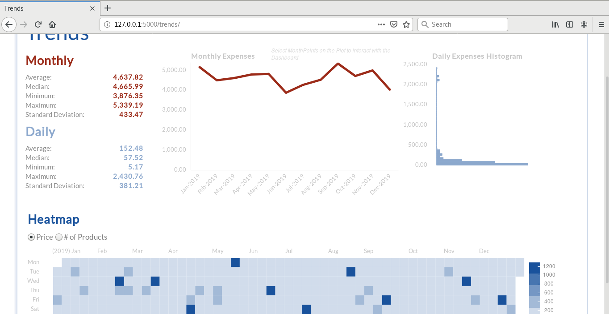
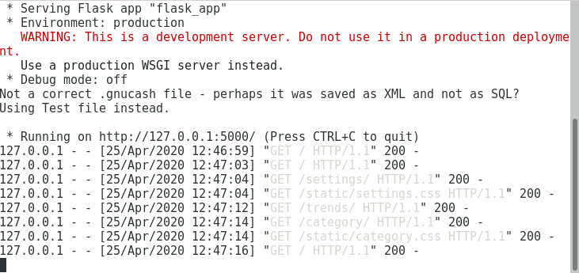

# GnuCash Expenses Visualizations
Visualizations of Expenses created in GnuCash Accounting 
Software.

## Description
Aim of the project is to present data from GnuCash Accounting 
Software (especially when it comes to individual Home Budgets)
using Bokeh visualization module. The project was also used
as a learning ground for the author in terms of simple web 
development and Bokeh server applications.

Trends View


flask_app running


## Prerequisites
Python >= 3.6.

There is an example GnuCash file included with the project, 
so you do not need to have your own to make it work. However, 
if you <b>do</b> have it, you can include file path to it 
in <i>gnucash_file_path.cfg</i> after cloning the repository.

Only SQLite files from GnuCash are accepted for now. If you 
keep track of your expenses in XML format, you can simply 
save them as SQL format in GnuCash application.

## Installation

Instructions for Linux:
1. Create new directory for the application.
2. Clone the repository into newly created directory and 
navigate there:
    ```bash
    git clone https://github.com/maciek3000/GnuCash-Expenses-Vis.git`
   cd GnuCash-Expenses-Vis 
   ```
3. Create new [venv](https://docs.python.org/3/library/venv.html)
and activate it:
    ```bash
    mkdir ./venv
    python3 -m venv ./venv
    source ./venv/bin/activate
    ```
4. Use [pip](https://pip.pypa.io/en/stable/) to install required packages:
    ```bash
   pip install -r requirements.txt 
   ```
   
## Usage
While in the GnuCash-Expenses-Vis folder, set flask 
variables and run the application:
   ```bash
   export FLASK_APP=flask_app
   flask run 
   ```

After using ```flask run``` command, local flask server should 
be up and running. New browser window should appear on the 
initialization - if for whatever reason it doesn't happen, 
you can manually go to [http://127.0.0.1:5000/](http://127.0.0.1:5000/),
where the application can be interacted with. 

There are currently 4 pages available - 3 views where you 
can look at your data from different angles (monthly/yearly/categorical) 
and 1 setting view where you can filter the data in regard 
to categories and date range.

## A thing about the Project
As mentioned above, the project was mostly used as a test 
ground of flask/bokeh modules. Surely some aspects of the
code could have been done better and without a doubt full
potential of GnuCash Application hasn't been realized.

However, the author created the application to use it 
with their own GnuCash data - including specific ways of 
tracking their own shopping list. Please keep in mind that 
your expenses might be saved differently, and so the whole 
experience might not be as it was intended to be.

## Author
Maciej Dowgird (https://github.com/maciek3000)

Version 0.0.1
April 2020

## License
MIT License

Copyright (c) 2020 Dowgird, Maciej

Permission is hereby granted, free of charge, to any person obtaining a copy
of this software and associated documentation files (the "Software"), to deal
in the Software without restriction, including without limitation the rights
to use, copy, modify, merge, publish, distribute, sublicense, and/or sell
copies of the Software, and to permit persons to whom the Software is
furnished to do so, subject to the following conditions:

The above copyright notice and this permission notice shall be included in all
copies or substantial portions of the Software.

THE SOFTWARE IS PROVIDED "AS IS", WITHOUT WARRANTY OF ANY KIND, EXPRESS OR
IMPLIED, INCLUDING BUT NOT LIMITED TO THE WARRANTIES OF MERCHANTABILITY,
FITNESS FOR A PARTICULAR PURPOSE AND NONINFRINGEMENT. IN NO EVENT SHALL THE
AUTHORS OR COPYRIGHT HOLDERS BE LIABLE FOR ANY CLAIM, DAMAGES OR OTHER
LIABILITY, WHETHER IN AN ACTION OF CONTRACT, TORT OR OTHERWISE, ARISING FROM,
OUT OF OR IN CONNECTION WITH THE SOFTWARE OR THE USE OR OTHER DEALINGS IN THE
SOFTWARE.